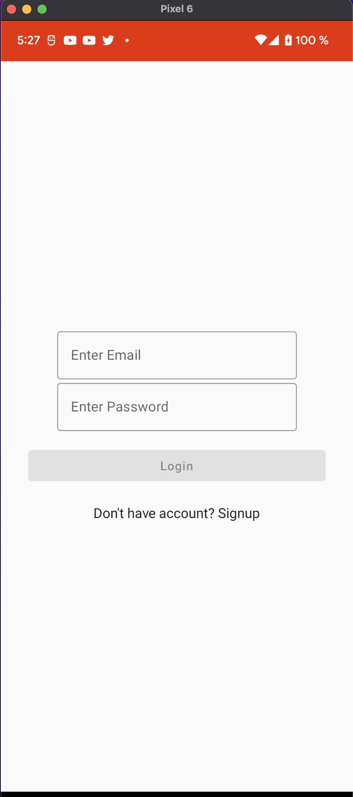
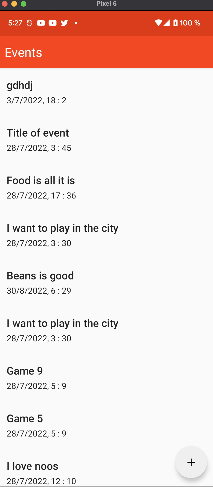
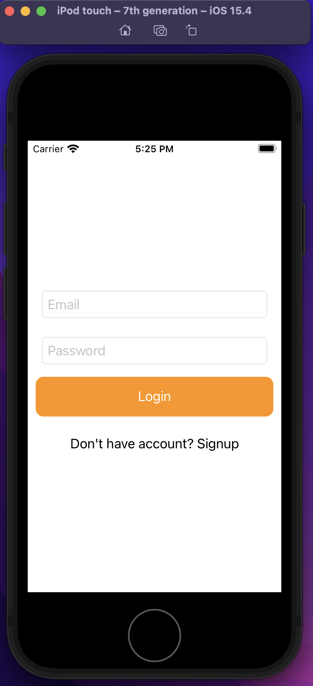
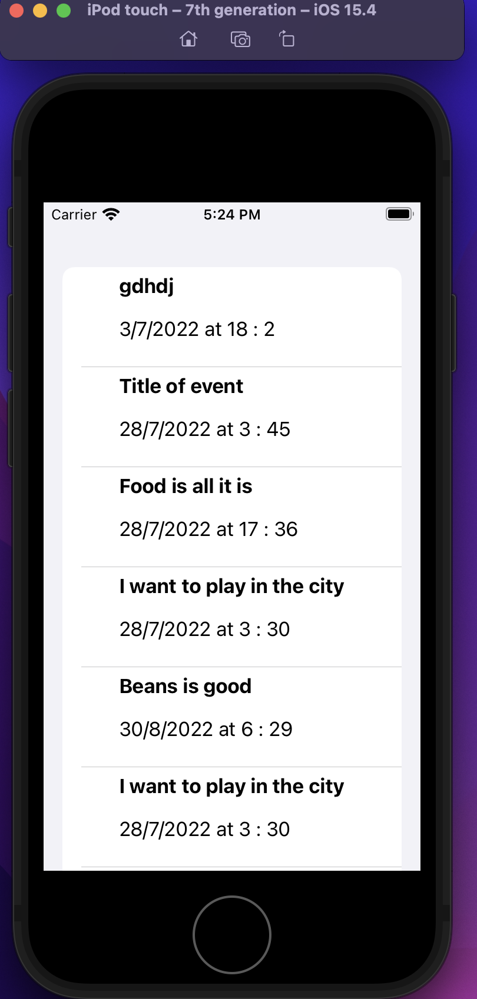
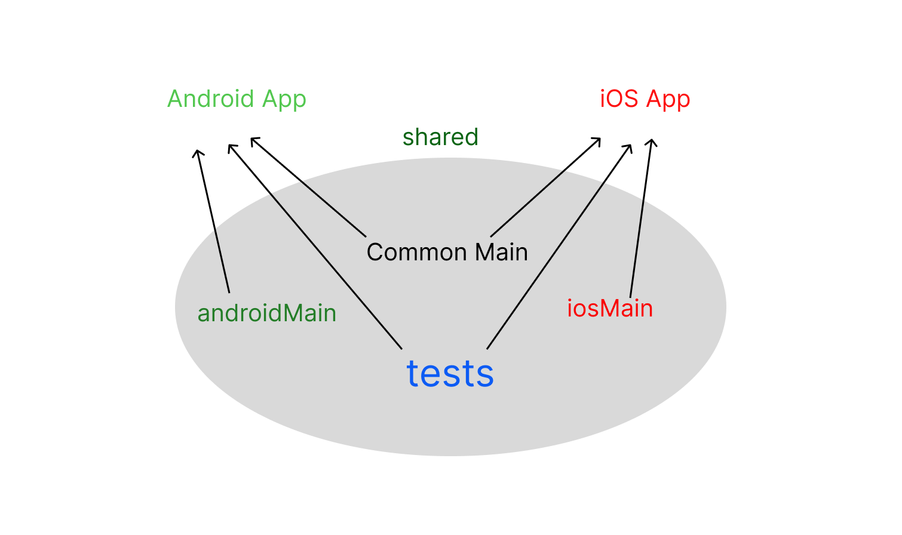

## Prerequisite
> It's assumed you have both [Android Studio](https://developer.android.com/studio?gclid=CjwKCAjw_ISWBhBkEiwAdqxb9kQK1LFtDkAS6AFU-ZCrzGpaFDed5-DYMMbisxO2YZ8uzx2vv6fn8xoCjWAQAvD_BwE&gclsrc=aw.ds) and [XCode](https://developer.apple.com/xcode/) installed.
## How to Build
* Clone the project to your local machine and open with Android studio.
	* ### Android
		* Let Android studio download dependencies.
		* Run the app Configuration. 
	* ### iOS
		* You can run the iOSApp configuration to build the iOS app.
		* Alternatively, after a successful build, you can open the iosApp.xcodeproj in XCode, then build and run.
 
 ## Project Description
  **Spontan** is a mobile application for managing events. Built using [KMM](https://kotlinlang.org/docs/multiplatform-mobile-getting-started.html).
  
#### Images from Android

####  Images from iOS

### Project Structure

 ### Architecture
 The Project is built using the [Clean Architecture](https://developer.android.com/topic/architecture?gclid=CjwKCAjw_ISWBhBkEiwAdqxb9i24YwlLSa_1H2Fvx9Ul4hQ0p4j7Gh7awjnS8BER1O8u8KH7BK8OFxoCSmsQAvD_BwE&gclsrc=aw.ds). 
### Tools

#### Shared
* [KMM](https://kotlinlang.org/docs/getting-started.html)
* [Kotlin Language](https://kotlinlang.org/)
* [Ktor client](https://ktor.io/docs/create-client.html)
* [Sqldelight](https://github.com/cashapp/sqldelight)
* [Kotlin serialization](https://kotlinlang.org/docs/serialization.html)
* [Kotlin Datetime](https://github.com/Kotlin/kotlinx-datetime)

#### Android
* [Jepack Compose](https://developer.android.com/jetpack/compose?gclid=CjwKCAjw_ISWBhBkEiwAdqxb9nzoYY4WLAU43nlDB8IQzOF35aFSFWex9lNGAYJICk40shwaF8lodhoCkWkQAvD_BwE&gclsrc=aw.ds)
* [Jetpack ViewModel](https://developer.android.com/topic/libraries/architecture/viewmodel?gclid=CjwKCAjw_ISWBhBkEiwAdqxb9myAeiqd-W8rKzPejJuUSdsCVDPTjWkgw8c_80zRF8ZD1gLI07KtLBoCUm8QAvD_BwE&gclsrc=aw.ds)

#### iOS
* [Combine](https://developer.apple.com/documentation/combine)
* [SwiftUI](https://developer.apple.com/xcode/swiftui/)

#### interesting links
* [Kotlin -> Swift/Objective-C Interoperability](https://kotlinlang.org/docs/native-objc-interop.html)